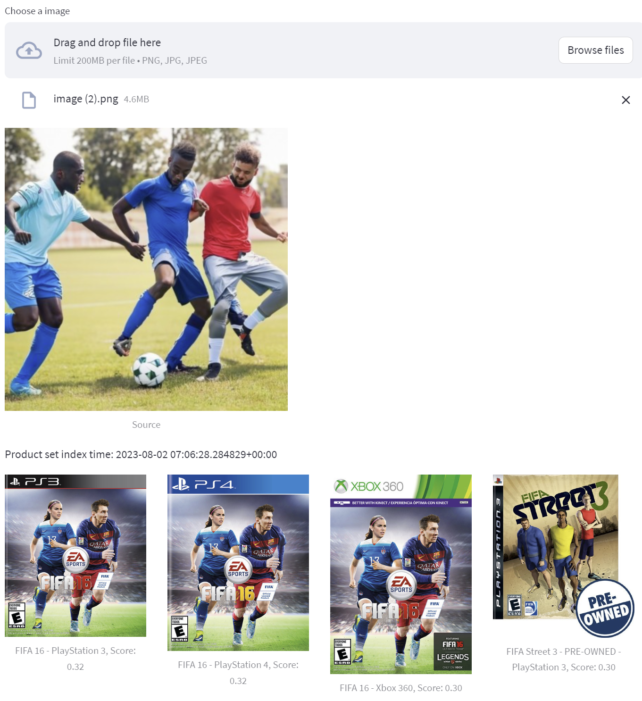

# Vision product search sample

## Brief
In this sample, you'll learn how to use Google Cloud's Vision product search api for building image search application using own images pool.
<div align="center"></div>

## Prepare sample dataset
This demo extends William Tsoi's sample(https://github.com/williamtsoi1/vision-api-product-search-demo). We'll reuse the sample data for building our own application.

```
#Copy import.py file to Cloud Shell for running import process faster
pip install pandas
pip install joblib
python import.py products_0.csv PROJECT_ID BUCKET_NAME    #Create bucket first
#Run on products_0.csv products_1.csv products_2.csv files. Each process need 30 minutes for indexing
```

## Launch dashboard
```
pip install streamlit
pip install pandas
pip install google-cloud-vision
python -m streamlit run main.py PROJECT_ID
```